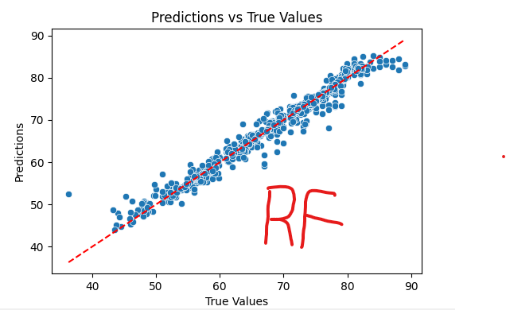

# Dokumentacija projekta – Predikcija životnog veka

## 1. Uvod

Cilj ovog projekta je izrada modela koji, na osnovu socio-ekonomskih i zdravstvenih pokazatelja, predviđa očekivani životni vek (*Life expectancy*) u različitim državama. Projekat spada u kategoriju regresionih problema, jer je ciljna promenljiva numeričkog tipa.  

Podaci obuhvataju demografske, ekonomske, socijalne i zdravstvene indikatore, pri čemu je poseban akcenat stavljen na stope imunizacije protiv **Hepatitisa B, Polia i Difterije**, kao i na **Indeks ljudskog razvoja (HDI)**. Odabrani su faktori koji najbolje oslikavaju stanje javnog zdravlja i kvalitet života populacije.  

Korišćeni skup podataka preuzet je iz **Global Health Observatory (GHO)** baze Svetske zdravstvene organizacije (WHO), kao i podataka Ujedinjenih nacija. Dataset obuhvata period od **2000. do 2015. godine** i sadrži informacije za ukupno **193 zemlje**.

---

## 2. Struktura dataset-a i njegova interpretacija

Ulazni skup podataka dostavljen je u `.csv` formatu i sadrži ukupno **22 kolone** i više od **2000 redova**.  
Radi lakšeg upoznavanja sa podacima, njihovog pregleda, kao i detekcije anomalija i nedostajućih vrednosti, u okviru projekta je implementirana pomoćna klasa (*data_load.py*). Ova klasa omogućava:

- vizuelizaciju osnovnih karakteristika skupa  
- pregled i proveru tipova podataka 
- detekciju nedostajućih vrednosti i anomalija  

### Kolone dataseta

Dataset obuhvata sledeće atribute:  

- **Country** – naziv zemlje  
- **Year** – godina posmatranja  
- **Status** – razvojni status zemlje (razvijena / u razvoju)  
- **Life expectancy** – očekivani životni vek (ciljna promenljiva)  
- **Adult Mortality** – smrtnost odraslih  
- **Infant deaths** – smrtnost odojčadi  
- **Alcohol** – prosečna potrošnja alkohola  
- **Percentage expenditure** – procentualna potrošnja na zdravstvo  
- **Hepatitis B** – stopa imunizacije protiv hepatitisa B  
- **Measles** – broj slučajeva malih boginja  
- **BMI** – prosečan indeks telesne mase  
- **Under-five deaths** – smrtnost dece mlađe od pet godina  
- **Polio** – stopa imunizacije protiv polia  
- **Total Expenditure** – ukupna izdvajanja za zdravstvo  
- **Diphtheria** – stopa imunizacije protiv difterije  
- **HIV/AIDS** – stopa obolelih od HIV/AIDS-a  
- **GDP** – bruto domaći proizvod po glavi stanovnika  
- **Population** – broj stanovnika  
- **Thinness 1–19 years** – učestalost pothranjenosti kod mladih od 1 do 19 godina  
- **Thinness 5–9 years** – učestalost pothranjenosti kod dece od 5 do 9 godina  
- **Income composition of resources** – indeks raspodele prihoda (komponenta HDI)  
- **Schooling** – prosečan broj godina školovanja  

Ove kolone je moguće uočiti pozivom funkicije `print(loader.columns())`


## 3. Kreiranje osnovnih klasa

Za potrebe rada sa podacima kreirana je pomoćna klasa **DataLoad** (*data_load.py*).  
Ova klasa služi za inicijalno učitavanje, pregled i osnovnu analizu podataka. Na taj način omogućava lakšu manipulaciju i kasniju pripremu podataka za treniranje modela.  

### Glavne funkcionalnosti klase
- **`__init__`** – učitava dataset iz prosleđenog fajla i proverava da li je fajl ispravan.  
- **`get_data()`** – vraća učitani DataFrame.  
- **`columns(quantity=None)`** – omogućava pregled svih ili samo prvih *n* kolona dataseta.  
- **`eda()`** – daje osnovne statistike o podacima (*describe* metoda).  
- **`detect_anomalies(col=None)`** – vizuelizuje potencijalne anomalije pomoću boxplot dijagrama, bilo za jednu odabranu kolonu ili za sve numeričke kolone.  
- **`drop(col)`** – omogućava brisanje izabrane kolone iz dataseta.  
- **`export_data(file_path="output.csv", file_type="csv")`** – eksportuje trenutni dataset u CSV fajl.  

Ova klasa je ključna za fazu **eksplorativne analize podataka (EDA)** jer pruža brze uvide u strukturu i kvalitet podataka, uz jednostavnu implementaciju vizuelizacija.  

---

### Eksplorativna analiza podataka (EDA) - describe()

Eksplorativna analiza je sprovedena kako bi se identifikovale:
- Nedostajuće vrednosti u kolonama  
- Anomalije i outlajeri  
- Potencijalne veze između socio-ekonomskih i zdravstvenih faktora  

Za vizuelizaciju korišćene su biblioteke **Matplotlib** i **Seaborn**, dok je deskriptivna statistika dobijena pomoću **pandas describe()** funkcije.  

### Primer – detekcija anomalija
Primer vizuelizacije outlajera u kolonama:  

```python
loader = DataLoad("data.csv")
loader.detect_anomalies("GDP")
```

Rezultat izvrsavanje:


Takođe heatmapa i histogram nam mogu pokazati odnos kako određeni feature je povezan sa drugim featurom i kako grafički da prikažemo naše podatke


Na primer sa heatmape vidimo da su percentage `expenditure` i `GDP` skoro u linearnoj zavisnosti 1/1 tako da pri obuci lakšoj našeg modela jednu od tih feature-a možemo da izbacimo iz razmatranja.
## 4. Eksplorativna analiza i priprema podataka – klasa EDA

Klasa **EDA** je implementirana kako bi omogućila bolju obradu i pripremu skupa podataka pre treniranja modela. Ona se nastavlja na osnovne funkcionalnosti klase `DataLoad`, ali dodaje i metode za:

- Popunjavanje nedostajućih vrednosti  
- Kodiranje kategorijskih podataka  
- Skaliranje i pondering kolona  
- Detekciju i korekciju anomalija pomoću linearne regresije  
- Proveru duplikata

### Konstruktor klase
```
eda = EDA(data=df)
```
- `data` - pandas DataFrame učitan iz `DataLoad` klase


### Provera nedostajućih vrednosti i duplikata

Kod obrade velikog broja redova, ideja je bila da sve vrednosti koje nam nisu poznate ili su duplirane, a ne utiču na našu tačnost modela uklonimo ili nekom drugom metodom zamenimo.

Primetićemo da kod našeg dataset-a ne postoje "duplikati", odnosno u slučaju dve različite države postojanje dva identična reda po njihovim vrednostima je praktično nemoguće, samim tim nikakve duplikate nismo uklanjali iz dataset-a.

Nedostajuće vrednosti smo najpre detektovali, i onda na osnovu proseka vrednosti za tu državu popunili nedostajuće redove u određenoj koloni. Ukoliko za neku državu (odnosno određenu kolonu države) nije bilo dovoljno podataka da se izračuna validan prosek, koristio se globalni prosek za tu kategoriju.

```
def impute_numeric(self, country_col='Country')
def print_duplicate_info(self)
```

### Obrada anomalija

Posto smo sa boxplot-ova mogli da vidimo pojavu anomalija za svaku kolonu našeg dataset-a, sledeći zadatak je bio da te vrednosti ispravimo kako ne bi smetale u našoj obuci. To smo radili prvobitnom detekcijom anomalija i onda provlacenjem tih anomalija kroz model linearne regresije.

Poredimo odnos (grešku) između vrednosti koja piše u tabeli i predviđene vrednosti i ako se te dve vrednosti dovoljno mnogo razlikuju za određeni faktor *(prag)* onda će dataset biti izmenjen.
```
def handle_anomalies(self, x_col='Life expectancy', z_thresh=2, exclude_cols=None):
```


*Vidimo da prikaz u konzoli navodi tacno koji su su featuri promenjeni*


*Prikaz novih vrednosti koje su izracunate LR*


### Kodiranje kategorijskih podataka

Kategorijske kolone je potrebno pretvoriti u numerički format kako bi ih modeli mogli koristiti. U ovom projektu koristimo **one-hot encoding** za kolonu `Status`, gde:

- `'developed'` → 1  
- Sve ostalo → 0  

Ovo omogućava modelu da razlikuje razvijene i zemlje u razvoju bez gubitka informacija.


Prikaz starog statusa


Prikaz kodiranog statusa

### Skaliranje i pondering kolona

Neke numeričke kolone mogu imati veći ili manji uticaj na model zbog svoje skale.  
Metoda **`weight_pondering()`** omogućava prilagođavanje težine kolona množenjem sa zadatim faktorom.  

Na primer, kolone `GDP` i `Total Expenditure` mogu se povećati ili smanjiti faktorom 1.5 i 0.01 kako bi njihova skala bila u skladu sa ostalim varijablama, što olakšava treniranje modela.

U našem modelu se koristilo da se doda značaj featurima napomenutim u zadatkuČ
```
eda.weight_pondering(['Hepatitis B', 'Polio', 'Diphtheria'], 1.5)
```
### 5. Modeli – izbor i evaluacija

Za predikciju očekivanog životnog veka korišćeni su različiti regresioni modeli, 3 koja smo radili na vežbama i 1 malo moćniji: **Linear Regression**, **Lasso**, **Ridge** i **Random Forest Regressor**.  

- **Linear Regression** je osnovni model koji omogućava brzo testiranje linearnog odnosa između ulaznih varijabli i ciljne promenljive
- **Lasso** i **Ridge** dodaju regularizaciju kako bi se smanjio overfitting i poboljšala generalizacija modela kod kolona sa velikim brojem feature-a.  
- **Random Forest Regressor** je moćan ensemble model koji hvata složenije, nelinearne odnose između faktora i životnog veka.

#### Parametri i evaluacija
- Kod Lasso i Ridge modela, ključni hiperparametar je **alpha**, koji kontroliše snagu regularizacije.  
- Kod Random Forest-a, bitni parametri su **n_estimators** (broj stabala) i **max_depth** (maksimalna dubina stabala).  

#### Metričke vrednosti za procenu tačnosti
- **MSE (Mean Squared Error)** – prosečna kvadratna greška predikcija, manja vrednost znači bolje slaganje sa stvarnim vrednostima.  
- **MAE (Mean Absolute Error)** – prosečna apsolutna greška, pokazuje prosečno odstupanje predikcija.  
- **R² score** – koeficijent determinacije koji pokazuje koliko model objašnjava varijansu ciljne promenljive, bliže 1 znači bolju preciznost.  

Ove metrike su ključne za izbor optimalnog modela i razumevanje koliko pouzdano model predviđa životni vek u različitim zemljama.

Najveći značaj će biti predat R² scoreu iz razloga što nam on predstavlja pandam accuracy-ja za klasifikacione probleme.

### Linear Regression

Linear Regression je korišćen kao polazni model zbog svoje jednostavnosti.
Ovaj model pretpostavlja linearnu vezu između ulaznih varijabli i ciljne promenljive (`Life expectancy`).  

Prednosti Linear Regression-a:  
- Brza obuka i laka interpretacija koeficijenata.  
- Dobar osnov za poređenje sa složenijim modelima.  

Nedostaci:  
- Ne hvata nelinearne odnose u podacima.  
- Osetljiv je na outliere i multikolinearnost.  


### Lasso Regression

Lasso (Least Absolute Shrinkage and Selection Operator) je linearan model sa **L1 regularizacijom**.  
Dodavanjem regularizacionog parametra **alpha**, Lasso smanjuje vrednosti koeficijenata, a neke čak postavlja na nulu, čime praktično vrši i selekciju važnih feature-a.  

Prednosti:  
- Uklanja manje značajne promenljive (feature selection).  
- Smanjuje rizik od overfitting-a.  

Nedostaci:  
- Previše visoka vrednost alpha može eliminisati suviše informacija.  


### Ridge Regression

Ridge je linearni model sa **L2 regularizacijom**.  
Umesto postavljanja koeficijenata na nulu, Ridge smanjuje njihove vrednosti proporcionalno regularizacionom parametru **alpha**.  

Prednosti:  
- Dobro funkcioniše kod multikolinearnosti.  
- Stabilniji od običnog Linear Regression modela.  

Nedostaci:  
- Ne eliminiše nepotrebne feature-e, samo ih smanjuje.  


I kod Lasso regresije i kod Ridge regresije vidimo da se vrednosti izlaza ne razlikuju za mnogo u odnosu na Linearnu regresiju. To je zbog dva razloga:
- Naš model je i dalje poprilično nelinearan, odnosno zavisnosti između feature-a su nelinearne, tako da je modelu jako teško da se izbori sa svim nepotrebnim featurima.
- Za jako malo *alpha* naši modeli se ponašaju skoro kao obična Linearna regresija, tako da je odstupanje od tog rezultata malo.

Takođe pri grid pretrazi se kod jednog modela iz skupa vrednosti alpha hiperparametara izbacila jako mala vrednost 0.001 čisto da bi se prikazala vrednost odziva za taj model.


### Random Forest Regressor

Random Forest je ensemble metoda zasnovana na velikom broju odlučujućih stabala.  
Svako stablo uči na nasumičnom podskupu podataka i feature-a, a finalna predikcija se dobija prosekom rezultata svih stabala.  

Prednosti:  
- Hvata složene, nelinearne odnose.  
- Otporniji je na outliere i šum u podacima.  
- Može da rangira značajnost feature-a.  

Nedostaci:  
- Može biti sporiji kod velikih dataset-ova.  
- Teže se interpretira u poređenju sa linearnim modelima.  




Osim metrika **MSE**, **MAE** i **R²**, kod Random Forest modela je analizirana i **feature importance**, što daje uvid u najuticajnije faktore na životni vek.


Vidimo da je HIV ima daleko najznačajniji uticaj u odnosu na sve ostale feature, što smo donekle i očekivali.
### Zaključak

Random Forest se pokazao kao najbolji model jer hvata nelinearne odnose i interakcije između atributa, što Linear Regression, Ridge i Lasso ne mogu u potpunosti da obrade. Pored toga, Random Forest je robusniji na outliere i ne zahteva stroge pretpostavke o podacima, pa prirodno daje bolje rezultate u ovakvim kompleksnim skupovima podataka.  

S druge strane, Linear Regression i njegovi regularizovani oblici (Ridge i Lasso) daju gotovo iste rezultate jer vrednosti hiperparametra `alpha` u Grid Search-u nisu bile dovoljno velike da značajno utiču na koeficijente. Kada je `alpha` vrlo mala, penalizacija regularizacije je zanemarljiva, pa se modeli ponašaju skoro identično kao čista Linear Regression. To objašnjava zašto su svi njihovi rezultati praktično isti.  
